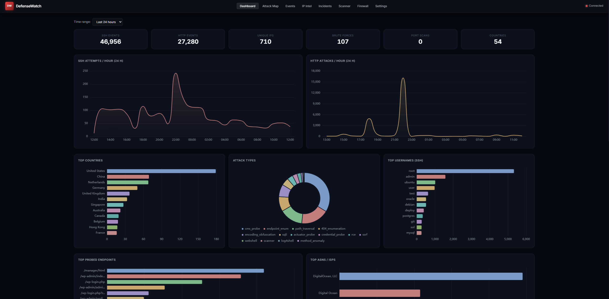
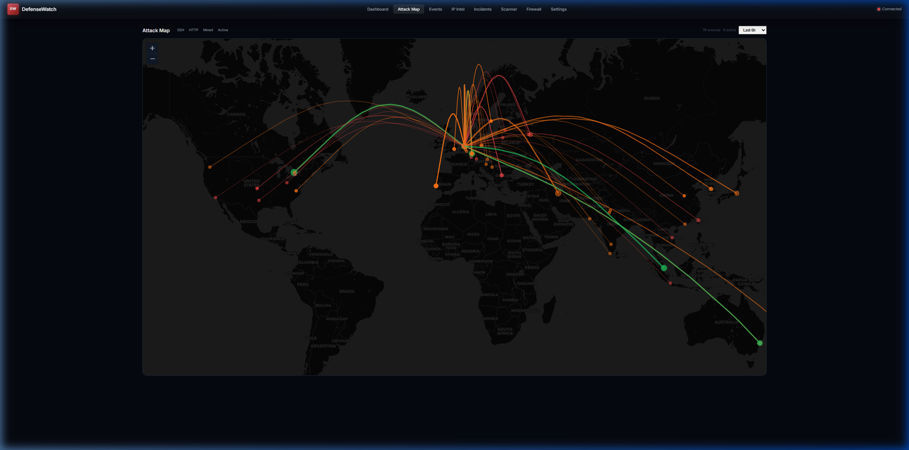
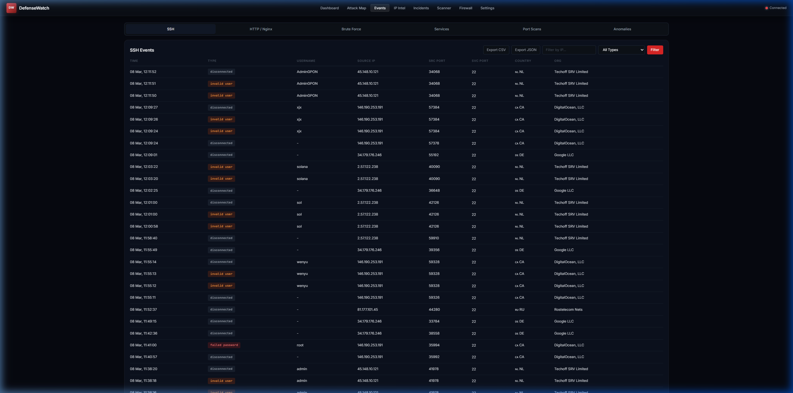

# DefenseWatch

A Host Intrusion Detection System (HIDS) that monitors SSH and HTTP logs in real-time, detects attacks, enriches threat data, and provides a live web dashboard with alerting capabilities.

## Features

- **Real-time log monitoring** - Watches SSH auth.log and Nginx access logs using inotify/polling, handles log rotation
- **Attack detection** - SSH brute force, HTTP attacks (SQLi, XSS, path traversal, etc.), port scanning across services
- **IP enrichment** - GeoIP (MaxMind + ip-api.com fallback), reverse DNS, WHOIS, and threat intelligence (AbuseIPDB, OTX)
- **Threat scoring** - Composite risk scores based on brute force attempts, attack patterns, scan behavior, and threat intel
- **Live dashboard** - Vanilla JS SPA with attack map (Leaflet), event tables, IP intelligence, charts (Chart.js)
- **WebSocket updates** - Events pushed to all connected browsers in real-time
- **Firewall integration** - Auto-block malicious IPs via ufw/iptables, configurable thresholds, expiry rules
- **Fail2Ban integration** - View jails, ban/unban IPs, manage configuration
- **Vulnerability scanning** - Nuclei-based scanning with vhost auto-detection and service profiling
- **Incident management** - Create, track, and link security incidents to events
- **Notifications** - Telegram bot alerts + webhook support with daily/weekly reports
- **Port scan detection** - Cross-service tracking of IPs probing multiple ports
- **Anomaly detection** - Baseline computation and hourly anomaly checks
- **Data retention** - Automatic cleanup of old events based on configurable retention period

## Screenshots

### Dashboard


### Auto-updating Attack Map


### SSH Events Feed


## Architecture

```
Log Files ──> Watchdog ──> Parsers ──> SQLite (WAL mode)
                                  ├──> WebSocket Broadcast ──> Browser Dashboard
                                  ├──> Enrichment Pipeline (GeoIP, rDNS, WHOIS)
                                  ├──> Threat Intel (AbuseIPDB, OTX)
                                  ├──> Port Scan Tracker
                                  ├──> Anomaly Detection
                                  ├──> Firewall Auto-Block
                                  └──> Notifications (Telegram, Webhooks)
```

**Tech stack:** Python 3.11+, FastAPI, SQLite (aiosqlite), Watchdog, vanilla JS + Tailwind CSS v4

## Quick Start

### 1. Install and Setup

```bash
git clone <repo-url> DefenseWatch
cd DefenseWatch
chmod +x setup.sh run.sh
./setup.sh
```

The setup script will create `config.yaml` and `.env` files with defaults.

### 2. Configure (Required)

**Edit `config.yaml`** to set your system-specific settings:

```bash
nano config.yaml  # or vim, or your preferred editor
```

At minimum, configure:
- `logs.ssh` - Path to your SSH auth log (usually `/var/log/auth.log` or `/var/log/secure`)
- `logs.http` - Path(s) to your Nginx/Apache access logs
- `host.name` - Your server's hostname
- `host.latitude` / `host.longitude` - Server coordinates for the attack map
- `firewall.whitelist` - Add any trusted IP addresses

**Optional:** Edit `.env` to add API keys for enhanced features:

```bash
nano .env
```

See the Configuration section below for details on finding log paths and coordinates.

### 3. Ensure Log File Access

```bash
sudo usermod -aG adm $USER
# Log out and log back in for this to take effect
```

### 4. Run DefenseWatch

```bash
./run.sh
```

Then open **http://127.0.0.1:9000** in your browser.

## Requirements

| Requirement | Required | Purpose |
|-------------|----------|---------|
| Python 3.11+ | Yes | Runtime |
| python3-venv | Yes | Virtual environment creation (`sudo apt install python3-venv`) |
| pip | Yes | Package installation (included with Python) |
| Read access to log files | Yes | `/var/log/auth.log`, `/var/log/nginx/*.log` (add user to `adm` group) |
| ufw or iptables | No | Firewall auto-blocking (requires passwordless `sudo`) |
| Docker | No | Nuclei vulnerability scanning |
| fail2ban | No | Fail2Ban jail management |
| GeoLite2-City.mmdb | No | Local GeoIP lookups (falls back to ip-api.com) |

## Installation

### Setup

```bash
./setup.sh
```

The setup script validates all requirements and:

1. Detects and validates Python version (3.11+)
2. Creates a virtual environment (with `python3-venv` check)
3. Installs Python dependencies from `requirements.txt`
4. Creates the `data/` directory for SQLite and GeoIP databases
5. Generates `config.yaml` from template if it doesn't exist
6. Copies `.env.example` to `.env` if it doesn't exist
7. Checks readability of all configured log files
8. Checks for GeoLite2 MMDB database
9. Validates firewall capabilities (ufw/iptables + sudo access)
10. Checks Docker availability for Nuclei scanner
11. Optionally installs a systemd service (reads host/port from config)

For a non-interactive install (skips systemd prompt):

```bash
./setup.sh --no-interactive
```

### GeoLite2 Database

For local GeoIP lookups, download the free GeoLite2-City.mmdb from [MaxMind](https://dev.maxmind.com/geoip/geolite2-free-geolocation-data) and place it at `data/GeoLite2-City.mmdb`. Without it, DefenseWatch falls back to the ip-api.com API.

### Firewall Access

For auto-blocking to work, the DefenseWatch process needs passwordless `sudo` for ufw:

```bash
# Create sudoers entry
echo "$USER ALL=(ALL) NOPASSWD: /usr/sbin/ufw" | sudo tee /etc/sudoers.d/defensewatch
```

### Log File Access

DefenseWatch needs read access to system log files. Add your user to the `adm` group:

```bash
sudo usermod -aG adm $USER
# Log out and back in for the change to take effect
```

### Docker (for Nuclei Scanner)

```bash
# Install Docker and add user to docker group
sudo usermod -aG docker $USER
# Pre-pull the Nuclei image
docker pull projectdiscovery/nuclei:latest
```

## Configuration

Configuration is split between two files:

- **`config.yaml`** - System-specific settings (log paths, thresholds, host info, feature toggles). Generated during setup. Git-ignored as it contains your system paths and preferences.
- **`.env`** - Secrets and API keys (API tokens, webhook URLs, Telegram credentials). Never committed (listed in `.gitignore`).

A template file `config.yaml.example` is provided in the repository as a reference.

Settings changed through the web dashboard are automatically persisted to the correct file -- secrets go to `.env`, everything else to `config.yaml`.

### Environment Variables (`.env`)

Copy `.env.example` to `.env` and fill in your values:

```bash
cp .env.example .env
```

| Variable | Description |
|----------|-------------|
| `DEFENSEWATCH_TELEGRAM_BOT_TOKEN` | Telegram bot token |
| `DEFENSEWATCH_TELEGRAM_CHAT_IDS` | Comma-separated Telegram chat IDs |
| `DEFENSEWATCH_WEBHOOK_URL` | Notification webhook URL (Slack, Discord, etc.) |
| `DEFENSEWATCH_REPORTS_WEBHOOK_URL` | Scheduled report webhook URL |
| `DEFENSEWATCH_ABUSEIPDB_API_KEY` | AbuseIPDB threat intel API key |
| `DEFENSEWATCH_OTX_API_KEY` | AlienVault OTX API key |
| `DEFENSEWATCH_SHODAN_API_KEY` | Shodan API key |
| `DEFENSEWATCH_VIRUSTOTAL_API_KEY` | VirusTotal API key |
| `DEFENSEWATCH_CENSYS_API_ID` | Censys API ID |
| `DEFENSEWATCH_CENSYS_API_SECRET` | Censys API secret |
| `DEFENSEWATCH_CORS_ORIGIN` | CORS allowed origin (default: `*`) |
| `DEFENSEWATCH_LOG_FORMAT` | Set to `json` for structured JSON logging |

Environment variables override any values in `config.yaml`. When you update secrets through the web dashboard Settings page, they are written to `.env` automatically.

### Config Sections (`config.yaml`)

| Section | Description |
|---------|-------------|
| `server` | Bind address and port (default: `127.0.0.1:9000`) |
| `logs` | Log file paths and service ports for SSH, HTTP, MySQL, PostgreSQL, mail, FTP |
| `detection` | Thresholds for brute force, HTTP scan, and port scan detection |
| `geoip` | MaxMind MMDB path and fallback API URL |
| `host` | Server display name and coordinates for the attack map |
| `database` | SQLite path, WAL mode toggle, retention period |
| `enrichment` | Queue size, worker count, WHOIS toggle |
| `firewall` | Auto-block thresholds, duration, whitelist |
| `notifications` | Enabled flag, severity filter, event types (webhook URL in `.env`) |
| `telegram` | Enabled flag, report schedule, severity filter (token/chat IDs in `.env`) |
| `threat_intel` | Enabled flag, refresh interval (API keys in `.env`) |
| `nuclei` | Docker image, severity filter, rate limit |
| `external_apis` | Placeholder section (API keys in `.env`) |

### Finding Your Log File Paths

Common log file locations:

- **SSH logs**: `/var/log/auth.log` (Debian/Ubuntu) or `/var/log/secure` (RHEL/CentOS)
- **Nginx access logs**:
  - Default: `/var/log/nginx/access.log`
  - Virtual hosts: Check `/etc/nginx/sites-enabled/*` for `access_log` directives
- **MySQL**: `/var/log/mysql/error.log` (check `/etc/mysql/mysql.conf.d/mysqld.cnf`)
- **PostgreSQL**: `/var/log/postgresql/postgresql-*.log`
- **Mail**: `/var/log/mail.log` (check Postfix/Dovecot configs)
- **FTP**: `/var/log/vsftpd.log` or `/var/log/proftpd/proftpd.log`

To find Nginx vhost logs: `grep -r "access_log" /etc/nginx/sites-enabled/`

### Setting Your Server Location

Edit `config.yaml` and set your server's coordinates for the attack map:

```yaml
host:
  name: my-server-name
  latitude: 40.7128   # Your server's latitude
  longitude: -74.0060 # Your server's longitude
```

To find your server's approximate coordinates, you can:
- Use an IP geolocation service with your server's public IP
- Look up your data center's city coordinates online
- Use: `curl "http://ip-api.com/json/" | grep -E "lat|lon"`

### Log Entry Format

Log entries support both plain paths and explicit port mappings:

```yaml
logs:
  ssh:
    - path: /var/log/auth.log
      port: 22
  http:
    - path: /var/log/nginx/access.log
      port: 443
    - path: /var/log/nginx/mysite.access.log
      port: 8080
```

Supported log types: `ssh`, `http`, `mysql`, `postgresql`, `mail`, `ftp`.

### Detection Tuning

```yaml
detection:
  ssh_brute_threshold: 5        # Failed attempts to trigger brute force alert
  ssh_brute_window_seconds: 300  # Time window for brute force detection
  http_scan_threshold: 20        # Suspicious requests to trigger HTTP scan alert
  http_scan_window_seconds: 60
  portscan_threshold: 3          # Distinct ports hit to trigger port scan alert
  portscan_window_seconds: 300
```

### Firewall Auto-Block

```yaml
firewall:
  auto_block_enabled: true
  ssh_block_threshold: 20         # Failed SSH attempts before blocking
  brute_session_block_threshold: 3 # Brute force sessions before blocking
  http_block_threshold: 100       # HTTP attack events before blocking
  score_block_threshold: 70       # Threat score threshold for blocking
  auto_block_duration_hours: 0    # 0 = permanent
  check_interval_seconds: 300     # How often to evaluate IPs for blocking
  whitelist:
    - 127.0.0.1
    - ::1
```

## Running

### Development

```bash
source venv/bin/activate
uvicorn defensewatch.main:app --host 127.0.0.1 --port 9000 --reload
```

### Using run.sh

```bash
./run.sh
```

`run.sh` validates that the venv, `config.yaml`, and `.env` exist, reads the host/port from `config.yaml`, and starts uvicorn.

### Production (systemd)

```bash
# Install during setup (interactive prompt)
./setup.sh
```

The setup script automatically generates and installs a systemd service file with the correct working directory, user, and host/port from your `config.yaml`.

**Note:** The `defensewatch.service` file in the repository is a template with placeholders. The actual service file is generated during setup.

Check status:

```bash
sudo systemctl status defensewatch
sudo journalctl -u defensewatch -f
```

### Docker Compose

```bash
docker compose up -d
docker compose logs -f
```

The Docker setup mounts host log files read-only and persists data in `./data/`. Set environment variables in `docker-compose.yml` or pass a `.env` file.

## API

All endpoints are under `/api/`. WebSocket endpoint at `/ws/live`.

| Endpoint | Method | Description |
|----------|--------|-------------|
| `/api/health` | GET | Health check |
| `/api/events/ssh` | GET | SSH events (paginated, filterable) |
| `/api/events/http` | GET | HTTP events (paginated, filterable) |
| `/api/events/brute-force` | GET | Brute force sessions |
| `/api/stats/summary` | GET | Dashboard summary counts |
| `/api/stats/top-ips` | GET | Most active threat IPs with tags |
| `/api/ips/{ip}` | GET | Full IP detail (enrichment, timeline, threat score) |
| `/api/ips/{ip}/timeline` | GET | 24-hour activity timeline |
| `/api/map/data` | GET | Attack map GeoIP data |
| `/api/firewall/status` | GET | Firewall status and capability |
| `/api/firewall/blocked` | GET | All blocked IPs (DB + system rules) |
| `/api/firewall/block` | POST | Block an IP via ufw/iptables |
| `/api/firewall/unblock` | POST | Unblock an IP |
| `/api/firewall/auto-block` | PATCH | Update auto-block settings |
| `/api/fail2ban/status` | GET | Fail2Ban status and jails |
| `/api/fail2ban/ban` | POST | Ban an IP in a jail |
| `/api/fail2ban/unban` | POST | Unban an IP |
| `/api/incidents` | GET | List incidents |
| `/api/incidents` | POST | Create incident |
| `/api/incidents/{id}` | GET | Get incident detail |
| `/api/incidents/{id}` | PATCH | Update incident |
| `/api/scanner/scans` | GET | List vulnerability scans |
| `/api/scanner/scan` | POST | Start a new Nuclei scan |
| `/api/settings/status` | GET | Current settings |
| `/api/settings/general` | PATCH | Update general settings |
| `/api/settings/webhooks` | PATCH | Update webhook settings |
| `/api/settings/api-keys` | PATCH | Update API keys (persisted to `.env`) |
| `/api/settings/detection` | PATCH | Update detection thresholds |
| `/api/settings/services` | POST | Add a monitored service |
| `/api/settings/services` | DELETE | Remove a monitored service |
| `/api/telegram/status` | GET | Telegram bot status |
| `/api/telegram/settings` | PATCH | Update Telegram settings (token/chat IDs to `.env`) |
| `/api/telegram/test` | POST | Send a test Telegram message |
| `/api/telegram/report` | POST | Send a report via Telegram now |
| `/ws/live` | WS | Live event stream (SSH, HTTP, brute force, port scan, anomaly, firewall) |

## Dashboard

The web UI is a single-page application with these sections:

- **Dashboard** - Summary stats, top IPs with attack type tags, recent events feed, attack timeline chart
- **Attack Map** - Global Leaflet map showing attack origins with animated lines to your server
- **Events** - Tabbed tables for SSH, HTTP, brute force, and anomaly events with filtering
- **IP Intel** - Detailed IP lookup with enrichment data, 24h timeline, threat score breakdown, port scans
- **Incidents** - Security incident tracking with create/edit modals and status workflow
- **Scanner** - Nuclei vulnerability scanner with target preview, per-host batching, and live finding feed
- **Firewall** - Manage blocked IPs, view all system firewall rules (ufw/iptables), Fail2Ban jails
- **Settings** - Configure webhooks, Telegram, API keys, detection thresholds, monitored services, general settings

## Project Structure

```
DefenseWatch/
├── config.yaml              # Runtime configuration (no secrets)
├── .env                     # Secrets and API keys (git-ignored)
├── .env.example             # Environment variable template
├── setup.sh                 # Installation + validation script
├── run.sh                   # Start script (reads config.yaml)
├── defensewatch.service     # systemd unit file template
├── Dockerfile               # Container build
├── docker-compose.yml       # Container orchestration
├── requirements.txt         # Python dependencies
├── data/                    # SQLite DB + GeoLite2 MMDB (git-ignored)
├── static/                  # Frontend (HTML, JS, CSS)
│   ├── index.html
│   └── app.js
├── defensewatch/
│   ├── main.py              # FastAPI app + lifespan + background tasks
│   ├── config.py            # Dataclass-based config loader + .env override
│   ├── database.py          # SQLite schema, migrations, retention cleanup
│   ├── broadcast.py         # WebSocket connection manager
│   ├── scoring.py           # Composite threat scoring
│   ├── notifications.py     # Webhook notifications
│   ├── telegram.py          # Telegram bot integration
│   ├── firewall.py          # ufw/iptables management + auto-block
│   ├── fail2ban.py          # Fail2Ban integration
│   ├── anomaly.py           # Anomaly detection + baseline computation
│   ├── reports.py           # Daily/weekly report generation
│   ├── parsers/
│   │   ├── ssh.py           # auth.log parser + brute force tracker
│   │   ├── http.py          # Nginx access log parser + attack detection
│   │   └── portscan.py      # Cross-service port scan tracker
│   ├── watchers/
│   │   ├── handlers.py      # Log file event handlers (SSH, HTTP, service)
│   │   └── manager.py       # Watchdog observer setup + shared tracker
│   ├── enrichment/
│   │   ├── geoip.py         # MaxMind MMDB + ip-api.com fallback
│   │   ├── pipeline.py      # Async enrichment workers (GeoIP, rDNS, WHOIS)
│   │   └── threat_intel.py  # AbuseIPDB + OTX integration
│   ├── scanner/
│   │   ├── nuclei.py        # Docker-based Nuclei scanner
│   │   ├── vhost_detect.py  # Nginx/Apache vhost detection
│   │   └── service_profiler.py # Tech detection + Nuclei tag selection
│   └── api/
│       ├── router.py        # Route mounting + health endpoint
│       ├── events.py        # Event query endpoints
│       ├── stats.py         # Summary + top IPs
│       ├── ips.py           # IP detail + timeline
│       ├── map.py           # Attack map data
│       ├── ws.py            # WebSocket endpoint
│       ├── firewall.py      # Firewall management API
│       ├── fail2ban.py      # Fail2Ban management API
│       ├── incidents.py     # Incident CRUD API
│       ├── scanner.py       # Scan management API
│       ├── settings.py      # Settings persistence (config.yaml + .env)
│       └── telegram.py      # Telegram settings API
└── tests/
```

## License

Copyright (C) 2026  H4X Labs

    This program is free software: you can redistribute it and/or modify
    it under the terms of the GNU General Public License as published by
    the Free Software Foundation, either version 3 of the License, or
    (at your option) any later version.
